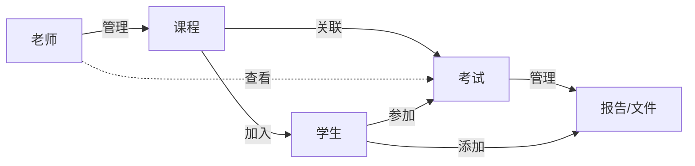

# 管理模块

管理模块负责维护老师、课程、学生、考试和报告/文件之间的业务关系。它主要服务于后台管理页面，让老师能够管理自己负责的课程，并查看课程下的考试、学生参与情况和材料提交情况。

当前先记录基础关系和配置，具体接口、字段校验和页面交互后续再补充。

## 关系模型

管理模块中的核心关系如下：

- 老师管理课程。
- 学生加入课程。
- 课程关联考试。
- 老师只能查看课程下的考试。
- 学生参加考试。
- 考试管理报告/文件。
- 学生添加报告/文件。

## 核心对象

| 对象 | 职责 | 基础字段 |
| --- | --- | --- |
| 老师 | 管理课程，查看课程下考试与学生提交情况。 | `teacher_id`、姓名、账号、所属组织 |
| 学生 | 加入课程，参加考试，添加报告/文件。 | `student_id`、姓名、账号、学号 |
| 课程 | 组织老师、学生、考试和课程资源。 | `course_id`、课程名称、老师 id、课程描述、课程状态 |
| 考试 | 挂载在课程下，供老师查看、学生参加。 | `exam_id`、课程 id、考试名称、开始时间、结束时间、考试状态 |
| 报告/文件 | 保存学生围绕考试提交的报告、代码或文档材料。 | `file_id`、考试 id、学生 id、文件类型、入库状态 |

## 基础配置

| 配置项 | 说明 | 后续补充 |
| --- | --- | --- |
| 课程管理 | 老师维护课程基础信息，查看课程学生列表和课程下考试列表。 | 课程创建、课程成员维护、课程状态流转 |
| 考试查看 | 老师查看考试基础信息、考试状态、参加学生和材料提交情况。 | 考试详情页、考试结果统计、筛选排序 |
| 学生加入 | 学生加入课程后，才能看到课程下可参加的考试。 | 邀请码、审批机制、批量导入 |
| 考试参加 | 学生从课程进入考试，并进入口试模块完成答题。 | 参加状态、开始/结束记录、异常处理 |
| 报告/文件管理 | 考试关联学生提交的报告、代码或文档，供后续出题和评分使用。 | 文件上传、解析、入库、删除、重新提交 |

## 页面入口

管理模块后续可以按以下页面组织：

- 课程管理：老师维护自己负责的课程，查看课程学生和课程下考试。
- 考试查看：老师查看考试信息、学生参加情况、报告/文件提交情况和口试结果。
- 学生课程：学生查看已加入课程和课程下可参加考试。
- 报告/文件：学生添加报告、代码或文档，老师查看提交状态。

## 权限边界

管理模块默认以角色为核心控制后台操作权限：

- 老师：可以管理自己负责的课程；只能查看课程下的考试、学生参加情况和报告/文件提交情况。
- 学生：可以加入课程、参加考试、添加自己的报告/文件，并查看自己的考试入口和结果信息。
- 管理员：后续可扩展为维护全局用户、课程、考试和系统配置。

## 后续补充

后续需要继续补充管理模块的接口定义、数据库字段、页面交互、异常状态和权限校验细节。